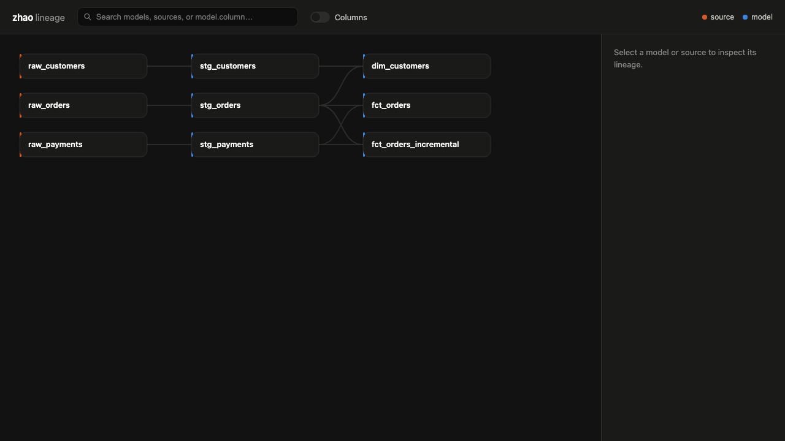

# Understanding lineage

`zhao lineage --html` turns your project's column-level lineage into a single, self-contained
HTML file you open in a browser — no server, no build step, no account, works fully offline
(there's nothing in the file that fetches anything: no CDN script, no font, no external
stylesheet). It's meant for exploring a project, not for CI.

```bash
zhao lineage --html lineage.html            # the whole project
open lineage.html                            # macOS; xdg-open on Linux, or just double-click it
```

**[Live demo](assets/lineage-demo.html)** — an actual export from a small fixture project,
committed in this repo. Open it in your browser to try the real thing rather than take our
word for what it does.



*(A real capture of the live demo above — click a model, turn on "Columns", click a
calculated column to trace it back to its actual source, then search for `model.column`.)*

## What you get

- **The whole DAG**, laid out left-to-right by dependency depth — sources on the left,
  everything they feed into further right.
- **Click a model** to highlight everything upstream and downstream of it; everything
  unrelated dims out.
- **Toggle "Columns"** to expand every model into its actual output columns — not just
  whatever's documented in `schema.yml` (dbt's manifest only ever has that), but zhao's own
  static resolution of each model's real output schema.
- **Click a column** to trace its specific lineage: which upstream columns it's actually
  derived from (including a calculated column like `coalesce(orders.amount, 0)`, traced back
  through however many CTEs it took), and which downstream columns actually consume it. A
  column zhao's static SQL resolver couldn't fully trace (a `UNION`, a window function, a
  subquery in `FROM`) is shown as `(unresolved)` — visibly, never silently dropped or shown
  as if fully traced.
- **Search** the top bar by model name, or by `model.column` to jump straight to a specific
  column in a large project without opening its model first.
- **Sort and filter columns** within a model's panel — useful once a model has more columns
  than fit comfortably on screen. Defaults to the model's actual `SELECT` order; toggle to
  A–Z/Z–A.

## Scoping the initial view

Pass a target the same way you would for text output, and the export opens already focused
on it:

```bash
zhao lineage --html lineage.html fct_orders            # opens with fct_orders selected
zhao lineage --html lineage.html fct_orders.amount      # opens at column grain
```

You can still navigate anywhere else in the project after it opens — this only sets where it
starts.

## Getting a fresh export

By default, `--html` reads whatever's already in `<project-dir>/target/manifest.json` — the
same "compile it yourself first" contract every other zhao command has. Pass `--compile` to
have zhao run `dbt compile` first:

```bash
zhao lineage --html lineage.html --compile
```

## What "static resolution" can and can't trace

Every column-to-column edge shown is a *real*, resolved reference — zhao never guesses. A
calculated column (a function call, `CAST`, arithmetic, `CASE`) traces to every column it
structurally references, however many CTEs deep, and its rendered SQL is shown alongside it.
What it deliberately doesn't attempt: `UNION`/`UNION ALL`, a subquery inline in `FROM` (as
opposed to a CTE), and window functions — these fall back to a real, node-level-tracked
dependency with an unresolved column mapping, rather than a wrong guess. That's a deliberate
trade: an admittedly-unresolved edge is safer than a confidently-wrong one.
